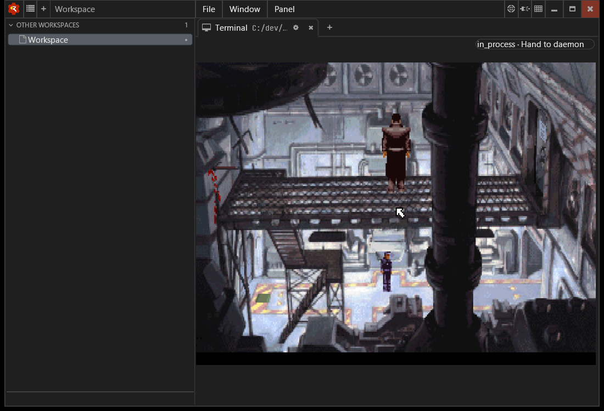
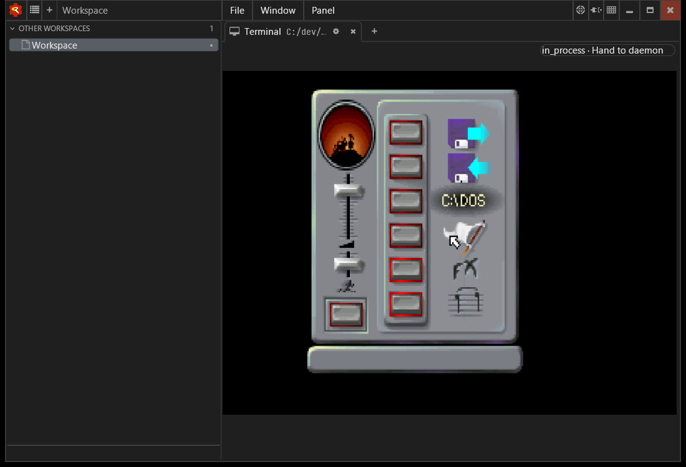

# ScummVM on Windows, 1 October 2026

Completes the remaining ScummVM run for [#74](https://github.com/rjwittams/katzensteg/issues/74).
Observed on Beaufort, Windows 11, in a Wheelhouse in-process Cleat terminal view.

## Results

- `scummvm.launcher` rendered ScummVM's game-selection interface. Tab moved
  keyboard focus into its search field in the initial run.
- `bass` loaded the freeware floppy version of Beneath a Steel Sky (v0.0348),
  rendered its introduction and reached the factory scene.
- Ctrl+F5 opened the game's control panel; Escape dismissed it and returned to
  the same scene. This verifies delivered keyboard input as well as rendering.

The screenshots below were taken through a private Porthole Windows server and
visually inspected. They capture only the test-owned Wheelhouse window.






## Reproduction and scope

The normal launcher entry points are:

```text
katzensteg scummvm.launcher
katzensteg bass
```

The checked-in profiles select SDL2 dynapi on Windows, the `surfacesdl` graphics
mode, terminal-only presentation and queued replay. The run used copies of the
profiles with machine-local paths for the existing ScummVM executable and game
data, plus separate stdout/stderr files. No runtime settings were changed.
`APPDATA` and Wheelhouse's user/project configuration were isolated in the test
directory, so the test did not use the operator's ScummVM configuration.

Revisions and dependencies:

- Katzensteg: `31a79eb` source tree, using the existing build from `687683b`
  (the complete tracked source trees compare equal).
- ScummVM: upstream `588da93d0c489bdb88a462f3627427f142346575`, the existing
  MSVC build from #79 with `sky` and `queen` engines, linked to SDL2 2.32.10.
- Wheelhouse: `6569443` (based on `1d4e5c1`), with
  key-release forwarding and message-position mouse clicks for #85 and #84.
- Cleat: `e233d6d`, Ghostty `c3dbb925`, bundled ConPTY; Jackstay `91156bf`;
  Andamento `44f791f`. Wheelhouse used its D3D11 renderer.

Porthole launched and drove the test windows under a temporary identity in an
isolated server with an in-memory policy store. Its grants covered its own
launches and windows. The windows were closed, the identity revoked and the
server stopped. No test processes remained after cleanup.

This is a rendering and keyboard smoke test, not a full playthrough. Mouse
gameplay, audio, saves, resize, quit escalation, other engines, RDP transitions
and locked-desktop recovery were not validated. Cannonball remains blocked on
ROM data as recorded in the external-projects matrix; ANESE's earlier acceptance
is unchanged.
