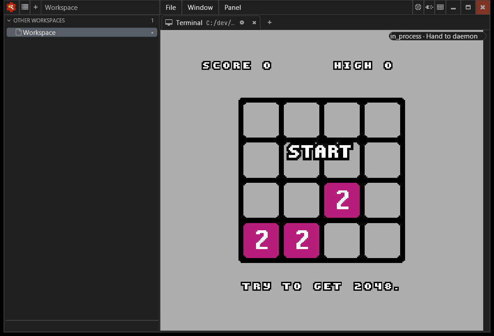
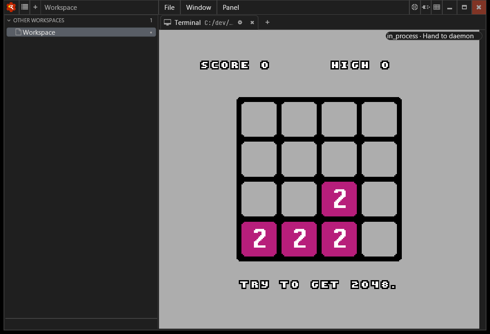
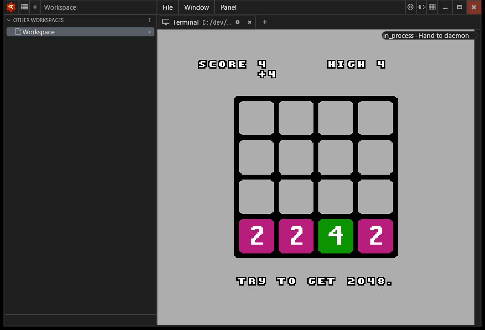
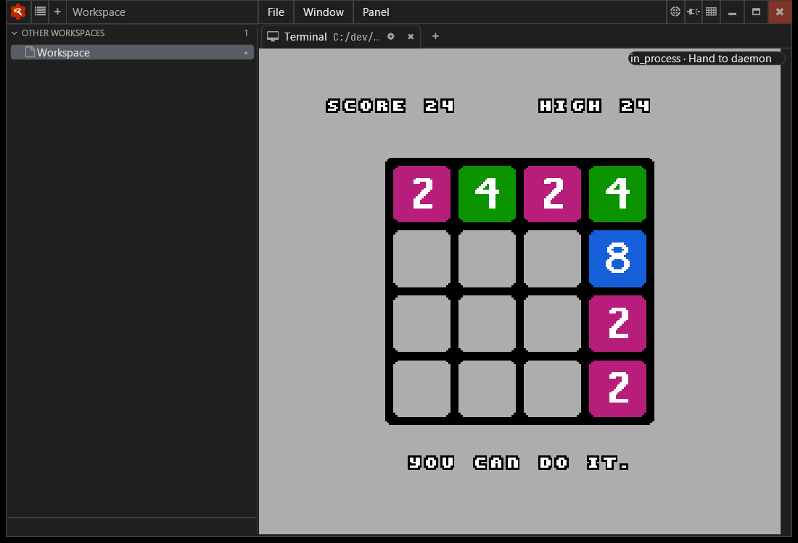
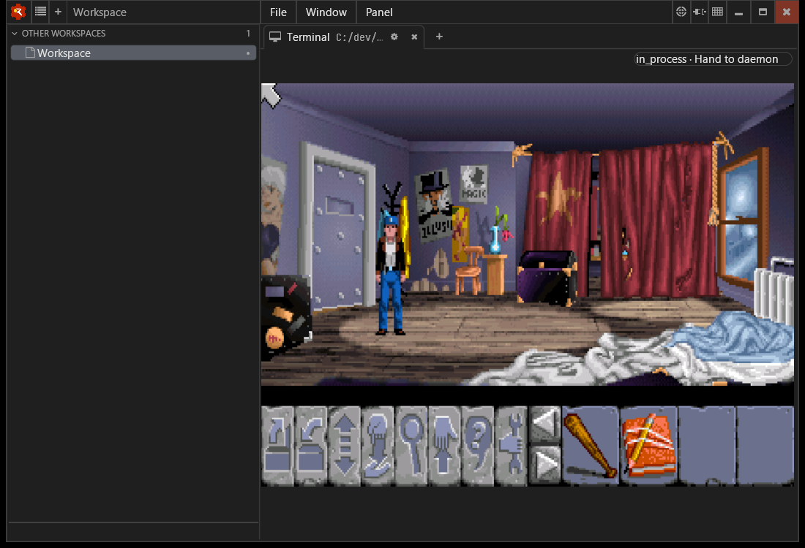
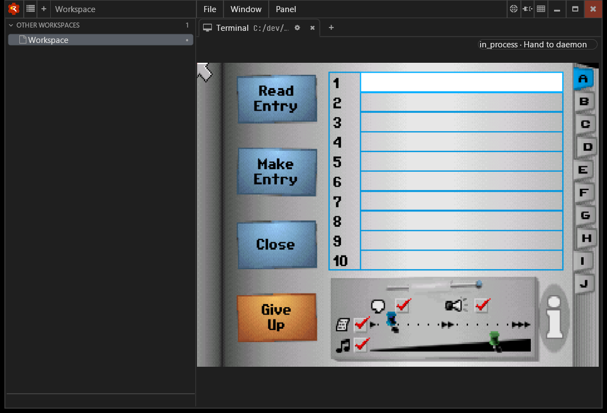
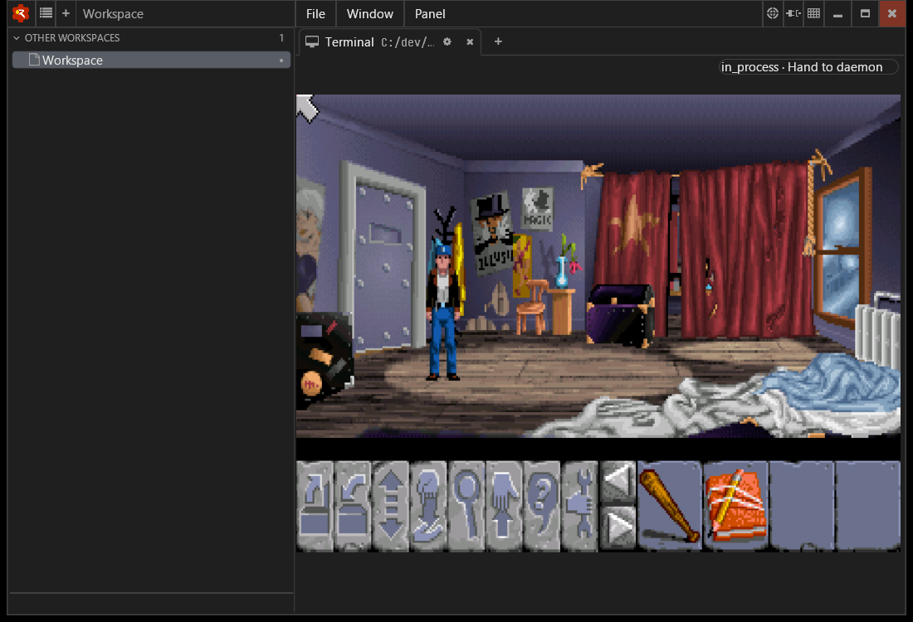

# Windows simple-app follow-up, 2 October 2026

Observed on Beaufort, Windows 11, through the Katzensteg launcher in a Wheelhouse
in-process Cleat terminal view. This follows the [ScummVM `sky` engine
validation](windows-scummvm-validation.md) and the merged Wheelhouse input fixes
in [#139](https://github.com/flotilla-org/wheelhouse/pull/139).

## ANESE

`anese.2048` rendered the homebrew game shipped in ANESE's `roms/demos`. Enter
started it. Three consecutive taps in each of Down, Left, Up and Right moved or
merged tiles. The first run reached a score of 32. A repeated run also accepted
the same sequence. This checks the earlier missing-arrow-release symptom in a
real application: another direction no longer has to intervene between taps.

The captures below show successive Down taps adding tiles to the board, followed
by the board after the complete four-direction sequence in the repeated run
(score 24).









`anese.test` did not complete its CPU-test ROM. It reported `Invalid Addressing
Mode` and `Unimplemented Instruction! 0xFF` at CPU step 146529 and left the game
area black. A native run with the same executable and ROM produced the same
messages. This is an ANESE limitation, not a passing conformance test or evidence
of a Katzensteg regression. No ANESE code or profile arguments were changed.

## ScummVM: Flight of the Amazon Queen

The existing ScummVM Windows build includes the `queen` engine. Its freeware
English floppy game rendered the introduction and the first game scene.
Escape skipped introduction segments; F5 opened the journal and Escape returned
to the scene. Three full injected runs and a native rendering baseline succeeded;
the last run loaded the checked-in `queen` profile with only app/game paths and
stdout/stderr overridden locally.







The first injected launch exited with `SDL_BlitSurface failed: Parameter 'src'
is invalid!`. Its first recorded `SDL_UpperBlit` had null source and destination
surfaces. Startup-only and full-sequence repeats did not reproduce the failure.
The successful smoke checks do not resolve that observation; it is tracked in
[#85](https://github.com/rjwittams/katzensteg/issues/85). No cause or fix has been
established.

The checked-in `queen` profile expects the extracted `queen.1` directly under
`$HOME/roms/queen` and uses the same SDL2 dynapi, `surfacesdl`, terminal-only and
queued-replay settings as `bass`. Automatic output selection chose `file_whole`
on this host. Launch it with:

```text
katzensteg queen
```

The game came from [ScummVM's official freeware downloads](https://www.scummvm.org/games/#queen).
The archive was `FOTAQ_Floppy.zip`, SHA256
`2e59de85f708cdb32bf85c85b394ac091c05f7647e856b71f5b3ae73fde761e0`, verified
against the published checksum. Game data is local and is not included here.

## Revisions and scope

- Katzensteg source: `d7e0819`; existing runtime build: `687683b`. Runtime source
  is unchanged between these revisions. Machine-local profile copies changed
  app/game paths and redirected stdout/stderr to separate files.
- Wheelhouse: `eb69133`, the head of merged #139, with its D3D11 renderer.
- ANESE: upstream `8ae814d615479b1496c98033a1f5bc4da5921c6f`, existing MSVC build.
- ScummVM: upstream `588da93d0c489bdb88a462f3627427f142346575`, existing MSVC
  build with the `sky` and `queen` engines.
- Both apps link the official SDL2 2.32.10 DLL.

Keyboard messages targeted only test-owned Wheelhouse windows. Each key was
held for 160 ms and released before the next tap. Screenshots came from a private
Porthole Windows server with an in-memory policy store and temporary identity;
only the test-owned windows were tracked. App configuration and Wheelhouse
user/project files were isolated. The test process trees were terminated, the
identity revoked and the server stopped; no test processes remained.

Cannonball still has no OutRun revision B ROM data locally, so its rendering and
input remain unvalidated. These checks do not cover mouse gameplay, audio,
saves, resize, quit escalation, remote-desktop transitions or a full playthrough.
